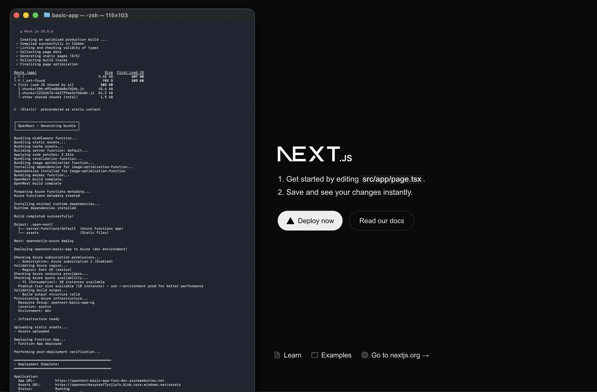

# OpenNext.js Azure

**True serverless Next.js on Azure Functions** (EXPERIMENTAL)

[](https://www.npmjs.com/package/opennextjs-azure)
[](https://www.npmjs.com/package/opennextjs-azure)
[](https://opensource.org/licenses/MIT)

Built on the [OpenNext](https://opennext.js.org) framework, this adapter brings native Next.js support to Azure Functions with a Vercel-grade developer experience.



> **🚀 New to Azure deployment?** Jump to [Quick Start](#quick-start) and run `npx opennextjs-azure@latest init --scaffold` to create a fully configured Next.js app on Azure in seconds!

## The Gap This Project Fills

Tutorials exist for static Next.js on Static Web Apps, standalone builds on App Service, and Docker-based deployments, but nothing for **true serverless Next.js on Azure Functions** with ISR, streaming SSR, and on-demand revalidation—until now.

Azure Functions is Microsoft's serverless compute platform—comparable to AWS Lambda and Cloudflare Workers, both of which already have OpenNext adapters. This project bridges that gap, bringing the same Vercel-grade developer experience to Azure: one command deploys your Next.js app with all the infrastructure you need.

## Next.js Features → Azure Services

| Next.js Feature                        | Azure Implementation                                            |
| -------------------------------------- | --------------------------------------------------------------- |
| Incremental Static Regeneration        | Azure Blob Storage                                              |
| Image Optimization                     | Azure Blob Storage with automatic caching                       |
| Streaming SSR                          | Azure Functions with Node.js streams                            |
| `revalidateTag()` / `revalidatePath()` | Azure Table Storage + Queue Storage                             |
| Fetch caching                          | Azure Blob Storage with build ID namespacing                    |
| Monitoring & Logging                   | Azure Application Insights (optional, enabled by default)       |
| Infrastructure                         | Azure Bicep templates upsert infrastructure in a resource group |

## Quick Start

### ⚡ Recommended: Create New Project with Scaffold

**The fastest way to get started** is using our scaffold command, which wraps `create-next-app` and sets up everything for Azure deployment:

```bash
npx opennextjs-azure@latest init --scaffold
```

This single command:

1. Creates a new Next.js 15 app (TypeScript, App Router, Tailwind, ESLint)
2. Adds Azure deployment dependencies (`opennextjs-azure`, `esbuild`)
3. Configures `next.config.ts` with `output: "standalone"`
4. Creates `open-next.config.ts` with Azure adapters
5. Generates `infrastructure/main.bicep` for Azure resources
6. Sets up `azure.config.json` for deployment configuration

Then build and deploy:

```bash
npx opennextjs-azure build
npx opennextjs-azure deploy
```

**💡 See it in action:** The [`examples/basic-app`](./examples/basic-app) directory (live at https://opennext-basic-app-func-dev.azurewebsites.net) was created using `init --scaffold` with zero manual configuration!

### 📦 Adding to Existing Project

If you have an existing Next.js project:

```bash
# Initialize Azure infrastructure
npx opennextjs-azure init

# Build for Azure
npx opennextjs-azure build

# Deploy (provisions infrastructure + deploys app)
npx opennextjs-azure deploy

# View live logs in Azure Portal
npx opennextjs-azure tail
```

## Intelligent Preflight Checks

Before deployment, the CLI validates your Azure environment to prevent failed deployments:

✓ **Azure CLI** installation and login status  
✓ **Subscription** permissions and state  
✓ **Region** availability  
✓ **Resource providers** (auto-registers Microsoft.Quota, Microsoft.Storage, Microsoft.AlertsManagement, etc.)  
✓ **Quota availability** for your target SKU  
✓ **Build output** structure

**Smart quota handling:** If you request `--environment prod` but don't have EP1 Premium quota, the CLI suggests `--environment dev` instead. Zero failed deployments from quota issues.

## Architecture

```
Next.js Request
    ↓
Azure Functions HTTP Trigger
    ↓
Azure HTTP Converter (request → InternalEvent)
    ↓
Azure Functions Wrapper (handles streaming)
    ↓
Next.js Server (OpenNext)
    ↓
ISR Cache Check → Azure Blob Storage
Tag Check → Azure Table Storage
Revalidation → Azure Queue Storage
    ↓
Response Stream → Azure Functions Response
```

## One Command, Full Infrastructure

`opennextjs-azure deploy` provisions everything via Bicep:

- Function App (with streaming support)
- Storage Account (blob containers, tables, queues)
- App Service Plan (Y1 Consumption or EP1 Premium)
- Application Insights (optional, for monitoring and logging)
- CORS configuration
- Environment variables
- Connection strings


Choose your environment:

- `--environment dev` → Y1 Consumption (pay-per-execution)
- `--environment staging` → EP1 Premium (always-ready instances)
- `--environment prod` → EP1 Premium (production-grade)

## How It Works

**Protocol Adapters:**  
Converts between Azure Functions HTTP triggers and Next.js InternalEvent/InternalResult format with full streaming support.

**ISR Implementation:**

- **Incremental Cache:** Azure Blob Storage stores rendered pages with `[buildId]/[key].cache` structure
- **Tag Cache:** Azure Table Storage maps tags → paths for `revalidateTag()`
- **Revalidation Queue:** Azure Queue Storage triggers on-demand regeneration

**Image Optimization:**

- **Source Images:** Loaded from `assets` blob container
- **Optimized Cache:** Processed images cached in `optimized-images` container to avoid re-processing
- **Processing:** Processing is done with the `sharp` library, which gets added for you during deployment.

**Build Process:**  
Uses OpenNext's AWS build with Azure-specific overrides, then adds Azure Functions metadata (`host.json`, `function.json`) for v3 programming model.

## Database & Service Bindings

Type-safe bindings for Azure services. Configure once in `azure.config.json`, access everywhere with full type safety.

```json
{
    "bindings": {
        "DB": {
            "type": "cosmos-sql",
            "databaseName": "mydb",
            "throughput": 400
        },
        "CACHE": {
            "type": "redis",
            "sku": "Basic",
            "capacity": 0
        }
    }
}
```

```typescript
// app/api/users/route.ts
import { getBinding } from "opennextjs-azure/bindings";

export async function GET() {
    const db = getBinding<"cosmos-sql">("DB");

    const database = db.database("mydb");
    const container = database.container("users");
    const { resources } = await container.items.readAll().fetchAll();

    return Response.json(resources);
}
```

Infrastructure provisioned automatically. Supports: Cosmos DB, Postgres, MySQL, Redis, Service Bus, Event Hub.

## CLI Commands

### `init --scaffold` (Recommended for new projects)

Creates a complete Next.js + Azure setup in one command:

```bash
npx opennextjs-azure@latest init --scaffold
```

This wraps `create-next-app` with Azure-specific setup. Supports all create-next-app options:

```bash
# Customize the scaffold
opennextjs-azure init --scaffold \
  [--no-typescript] \
  [--no-tailwind] \
  [--no-eslint] \
  [--no-src-dir] \
  [--no-app-router] \
  [--import-alias <alias>] \
  [--package-manager npm|yarn|pnpm|bun]
```

### Other Commands

```bash
# Initialize Azure infrastructure in existing project
opennextjs-azure init

# Build Next.js app for Azure
opennextjs-azure build [-c <config-path>]

# Deploy to Azure
opennextjs-azure deploy \
  [--app-name <name>] \
  [--resource-group <name>] \
  [--location <region>] \
  [--environment dev|staging|prod] \
  [--skip-infrastructure]

# View live logs in Azure Portal
opennextjs-azure tail \
  [--app-name <name>] \
  [--resource-group <name>]

# Check deployment health
opennextjs-azure health \
  [--app-name <name>] \
  [--resource-group <name>]

# Delete resource group and all resources
opennextjs-azure delete \
  [--resource-group <name>] \
  [--yes] \
  [--no-wait]
```

## License

[MIT](./LICENSE)

## Contributing

Contributions are welcome! Whether it's bug fixes, feature additions, or documentation improvements, we appreciate your help in making this project better. For major changes or new features, please open an issue first to discuss what you would like to change.
